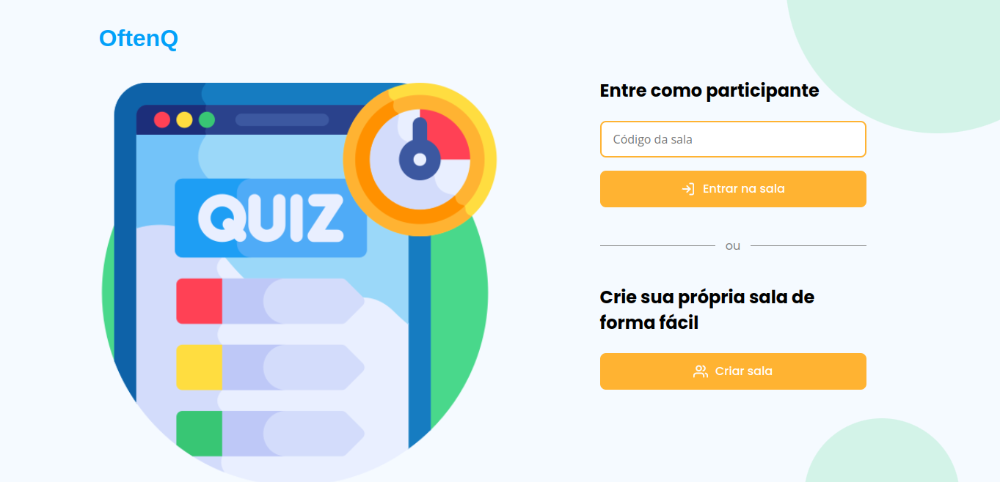
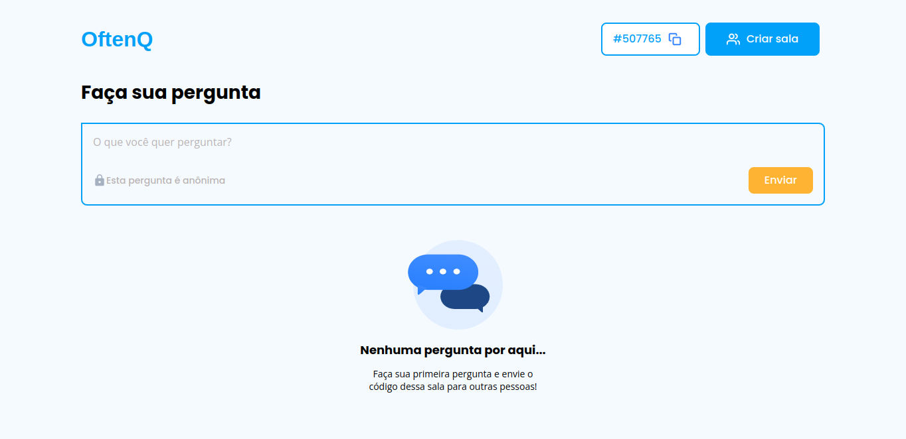
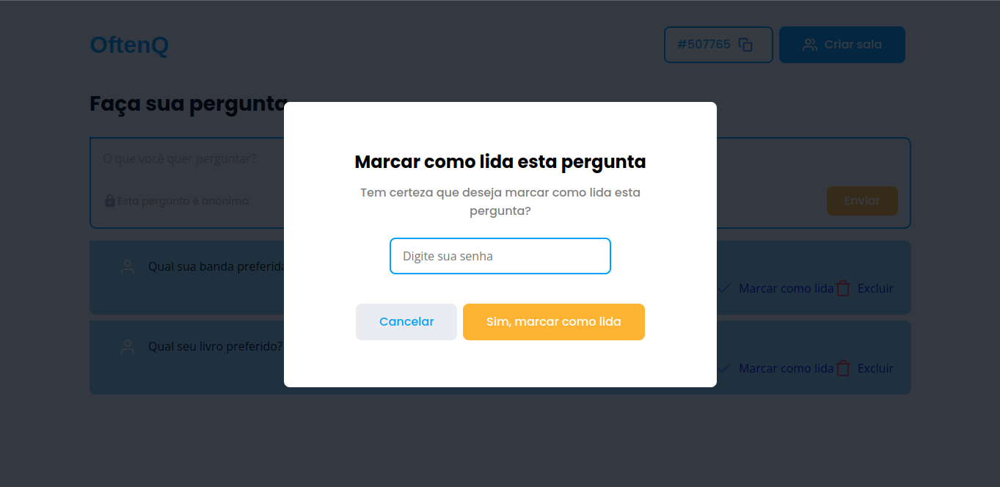

### Projeto da Rocketseat Discover
###### Por Priscila Teodório

Fiz esse projeto que ensinam no curso da Rocketseat, porém com algumas modificações, pois pretendo adicionar mais algumas funcionalidades.

#### Descrição do projeto:

Um quiz sobre qualquer coisa, pode criar salas dos assuntos, perguntas anônimas e os criadores das salas respondem. 

###### A página inicial



###### A página da sala



###### A modal de marcar como lida


#### Rodar o projeto

No terminal 

```
npm start
```
Roda localmente na porta: http://127.0.0.1:3000/

#### Mais sobre a estrutura:
Banco de dados usado: SQLite

#### Coisas que aprendi:

1rem = 16px
rem é mais usado, pois ajuda a ser resposivo

font-size: (mínimo, padrão, máximo);

Para não precisar editar a imagem: formas geométricas
https://bennettfeely.com/ 

Exemplo do próprio css:
clip-path: circle(); 

ejs é resposavel pelo layout 
por isso precisa configurar

#### Útil


Fontes:
https://fonts.google.com/

Icones: https://www.flaticon.com/free-icons
 https://fontawesome.com/v5.15/icons?d=gallery&p=1 
 https://feathericons.com/
 

